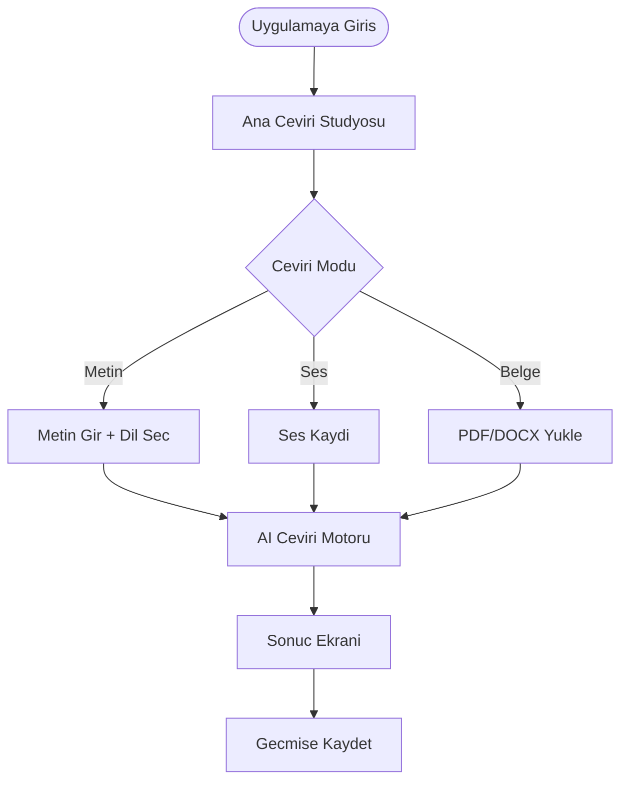

# Sprint 2 User-Flow

```mermaid
flowchart TD
    Start([Uygulamaya Giris]) --> Studio[Ana Ceviri Studyosu]
    Studio --> Mode{Ceviri Modu}
    Mode -->|Metin| TextIn[Metin Gir + Dil Sec]
    Mode -->|Ses| VoiceIn[Ses Kaydi]
    Mode -->|Belge| DocIn[PDF/DOCX Yukle]
    TextIn --> AI[AI Ceviri Motoru]
    VoiceIn --> AI
    DocIn --> AI
    AI --> Output[Sonuc Ekrani]
    Output --> Save[Gecmise Kaydet]
```
